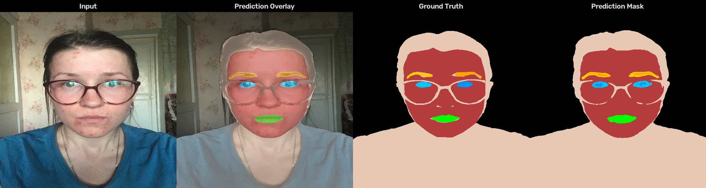

# Facial Segmentation with UNet++ and EfficientNet-B3

A deep learning pipeline for **multi-class facial segmentation** that decomposes human face images into 9 semantic regions at pixel-level accuracy.

Built with a two-phase **transfer learning** strategy and aggressive **Focal Loss** to handle extreme class imbalance between large regions (background, skin) and tiny facial features (eyebrows, eyes).



## Architecture

```
Input Image (1024×1024×3)
         │
         ▼
┌──────────────────────┐
│   EfficientNet-B3    │  ← Pretrained ImageNet encoder (frozen in Phase 1)
│   (Encoder / Brain)  │
└──────────────────────┘
         │
         ▼
┌──────────────────────┐
│      UNet++ Decoder  │  ← Dense skip connections + scSE attention
│   (Decoder / Hands)  │
└──────────────────────┘
         │
         ▼
Output Mask (1024×1024×9)  → 9 classes per pixel
```

## Segmentation Classes

| Class ID | Type  |
|----------|-------|
| 0        | Large |
| 1        | Large |
| 2        | Large |
| 3        | Small |
| 4        | Small |
| 5        | Small |
| 6        | Small |
| 7        | Small |
| 8        | Small |

## Results

Trained on **3,500 images** at **1024×1024** resolution on a Tesla T4 GPU.

| Metric                       | Score    |
|------------------------------|----------|
| **Frequency-Weighted Dice**  | **0.970**|
| Macro-Large Dice (0–2)       | 0.969    |
| Macro-Small Dice (3–8)       | 0.569    |
| Macro-Average Dice           | 0.702    |

### Per-Class Breakdown

| Class        | Dice Score |
|--------------|------------|
| Class 0      | 0.9810     |
| Class 1      | 0.9688     |
| Class 2      | 0.9563     |
| Class 3      | 0.3579     |
| Class 4      | 0.4020     |
| Class 5      | 0.3644     |
| Class 6      | 0.4648     |
| Class 7      | 0.8393     |
| Class 8      | 0.9849     |

> **Note:** Small facial features (eyebrows, eyes) remain challenging due to extreme pixel-level class imbalance. These classes represent less than 0.2% of total image pixels, making them inherently difficult for encoder-based architectures that compress spatial resolution through pooling layers.

## Project Structure

```
Facial_Segmentation/
├── train.py           ← Two-phase training pipeline
├── evaluate.py        ← Evaluation with multi-scale TTA
├── visualize.py       ← Generate visual prediction comparisons
├── requirements.txt   ← Python dependencies
├── LICENSE            ← MIT License
├── .gitignore
├── README.md
│
├── data/              ← Dataset (not included — see below)
│   ├── images/
│   │   ├── train/
│   │   ├── val/
│   │   └── test/
│   └── annotations/
│       ├── train/
│       └── val/
│
└── results/           ← Generated visualizations (after running visualize.py)
```

## Setup

### 1. Clone the Repository

```bash
git clone https://github.com/<your-username>/Facial_Segmentation.git
cd Facial_Segmentation
```

### 2. Install Dependencies

```bash
pip install -r requirements.txt
```

### 3. Download the Dataset

This project uses the facial segmentation dataset from the [Slicee My Face](https://www.kaggle.com/competitions/slicee-my-face/data) challenge.

1. Download the dataset from the link above (requires a Kaggle account).
2. Extract the contents into the `data/` directory so the folder structure matches the one shown above.

### 4. Download Pretrained Weights (Optional)

If you want to skip training and directly run inference or evaluation, download the pretrained weights from the **[Releases](../../releases)** page of this repository and place `best_model.pth` in the project root.

## Usage

### Train from Scratch

```bash
python train.py
```

The training pipeline automatically:
1. **Phase 1** (10 epochs) — Freezes the EfficientNet-B3 encoder and trains only the UNet++ decoder.
2. **Phase 2** (30 epochs) — Unfreezes the encoder and fine-tunes the full network with differential learning rates (encoder: 1e-5, decoder: 1e-4).
3. Saves the best checkpoint to `best_model.pth` based on validation Dice score.
4. Runs final validation with Test-Time Augmentation (TTA).

Training supports **automatic checkpoint resumption** — if interrupted, simply re-run `python train.py` and it will continue from where it left off.

### Evaluate

```bash
python evaluate.py
python evaluate.py --checkpoint path/to/model.pth
```

Produces a detailed evaluation report with per-class Dice scores, macro-averaged metrics, and frequency-weighted Dice using multi-scale TTA.

### Visualize Predictions

```bash
python visualize.py                           # 5 random validation images
python visualize.py --num 10                  # 10 random validation images
```

Generates side-by-side comparison images (Input | Ground Truth | Prediction) with color-coded class overlays. Results are saved to the `results/` directory.

#### Test on Custom Images
You can also run the model on any new image (without ground truth) to see how it performs in the wild:
```bash
python visualize.py --checkpoint latest_model.pth --image path/to/any_face.jpg
```
This will automatically generate a side-by-side comparison (Input | Overlay | Mask) and save it to the `results/` directory.

## Technical Details

### Loss Function

The model uses a **combined loss** specifically designed for extreme class imbalance:

```
Loss = 0.4 × Weighted CE + 0.4 × Focal Loss + 0.2 × Dice Loss
```

- **Weighted Cross-Entropy:** Applies class weights ranging from 0.1 (background) to 100.0 (small features) to counteract pixel-frequency imbalance.
- **Focal Loss (γ=2.0):** Dynamically scales the loss to focus on hard, misclassified pixels near class boundaries.
- **Dice Loss:** Directly optimizes the Dice coefficient, which is the primary evaluation metric.

### Test-Time Augmentation

During evaluation and inference, predictions are averaged across:
- **3 scales:** 0.75×, 1.0×, 1.25× resolution
- **Horizontal flip** at each scale

This produces 6 predictions per image, which are averaged for maximum accuracy.

### Hardware Requirements

| Setup                | Batch Size | Training Time   |
|----------------------|-----------|-----------------|
| Tesla T4 (16 GB)     | 2         | ~5 hours        |
| RTX 4090 (24 GB)     | 4         | ~2 hours (est.) |
| CPU only             | 1         | Not recommended |

> **Minimum VRAM:** ~12 GB for 1024×1024 resolution with batch size 2.

## License

This project is licensed under the MIT License. See [LICENSE](LICENSE) for details.
